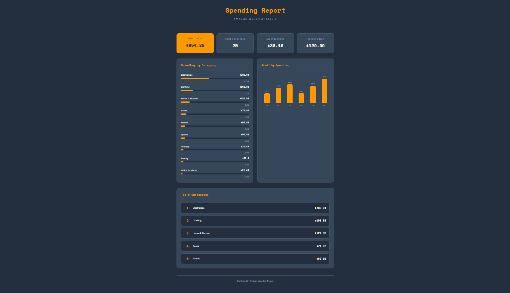
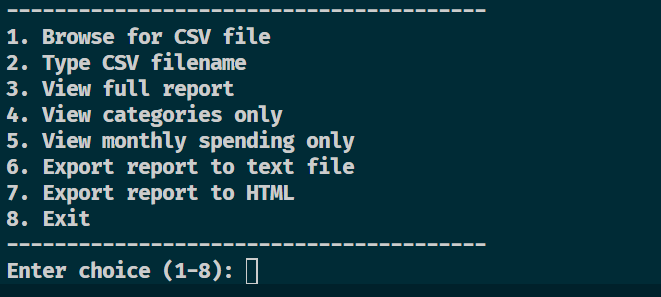
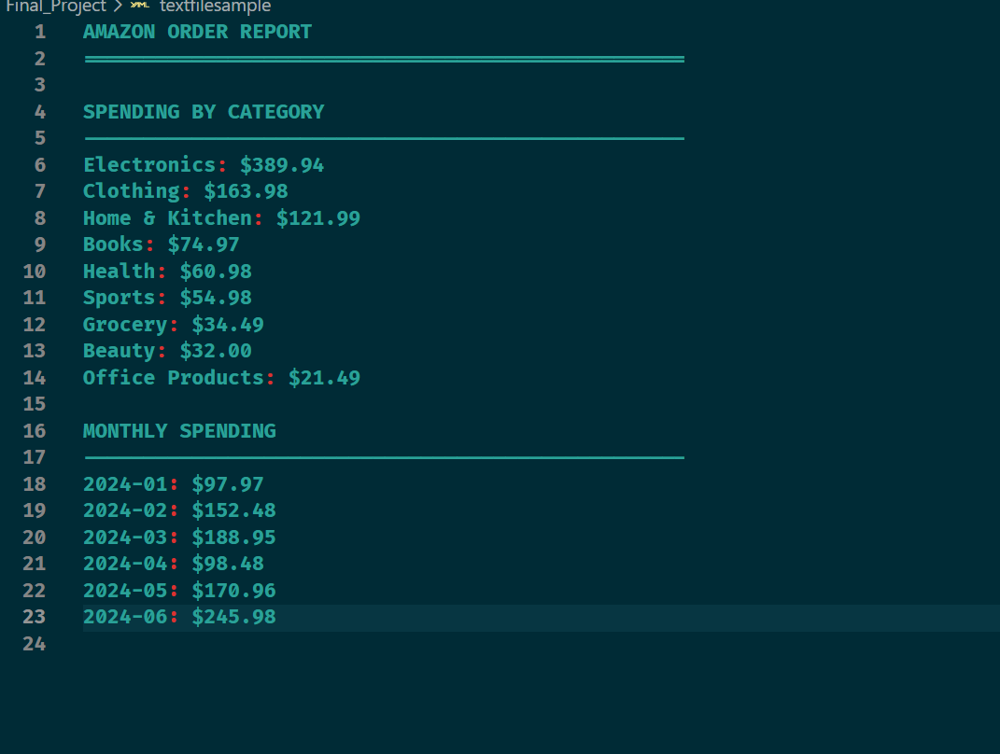

# Amazon Spending Tracker 
**Creator:** Diego Aldas 

## Project Overview
This program is used to look over and analyze a person's Amazon order history from a downloadable CSV files. The tracker helps users understand their spending habits by giving the user total spent by categories, and monthly trends. Most people use Amazon for it's easy access and fast delivery, however few people realize how much they are actually spending on Amazon since very few track their spending. Amazon allows you to download your spending in the form of a CSV file but the raw data is confusing to understand and a little hard for the eyes.The Amazon spending tracker reads the CSV file and cleans the data and groups purchases based on category and by month.Then it displays statistics and data in a easy to read and understand format for the user.

## Features 
The core feature of the program includes loading Amazon order history through a graphical file picker or manual filename entry. One the file is loaded by data is cleaned through different data format handling, rmeoving dollar signs and skipping invalid rows. In terms of the analysis the program calculates total spending, broken down by category and tracks monthly trend . It also calculates different statistics like average,order value, highest purchase, lowest purchase and what percentage of each category corresponds to the total spending.

## Obtaining your Amazon Data 
Sign into your Amazon account and navigate to your Account & List then your account and download order reports. Then select your desired range and requesr the report. Once the report is created dowbload the csv file and place it in the same folder running the project.

## Running the Program 

1. Open program file and select file directory 
2. Open and run main.py file 
3. Dropdown menu will appear in terminal 
4. Pick either option 1 or 2 to browse for file or enter file manually
5. Options 3-5 show different report views including full report,category breakdown only,monthly trends only.
6. Option 6-7 allows you to export your report as a text file or HTML file given the users desire. 
7. Select option 8 to exit the program
   
## Files 
**main.py** serves as the entry point, displaying the welcome message and menu while coordinating all other modules.

**data_loader.py** handles CSV file reading and provides the graphical file picker dialog using tkinter.

**data_cleaner.py** processes raw Amazon data, standardizing date formats, cleaning price strings, and filtering out invalid entries.

**analytics.py** performs all calculations including totals, category grouping, sorting, and statistical analysis.

**display.py** formats and prints results to the terminal with headers, separators, and text-based visualizations.

**export.py** writes reports to text files using the same calculations as the display module.

**html.py** generates visual HTML reports by building the page structure and embedding CSS styles directly.

**styles.css** contains all styling rules using Amazon's orange and dark blue brand colors with modern card layouts.

**script.js** adds hover animations using vanilla JavaScript, making cards grow and elements glow on interaction.

**sample_amazon_orders.csv** provides 25 fake orders across various categories for testing without real data **Replace with your file this is used for testing**

## AI Use/Attribution
For my use of an AI assistant I used Claude AI which helped me develop and debug the html.py,because it was my first time generating HTML through Python string concatenation and I needed it to be explained and make sure it had the features I wanted it to have and that I was able to understand parts of the code when it came to debugging. Overall claude helped me structure my code clearly and helped me identify bugs like mispelled statements and certain problems with code indentation. In addition claude AI also provided the sample amazon order csv file as it created a random user spending file for testing and helped me incorporate JavaScript for user interactivity (hover effects).

## Technologies Used

**Python** was primarly used to handle the core logic including file processing, data cleaning, calculations, and output generation. Only built-in libraries like csv and os are required.

**HTML and css** create the visual structure and styling. Flexbox and grid manage the layout while custom properties define the color scheme.

**JavaScript** powers the interactive hover effects using DOM methods covered in previous coursework. Tkinter provides the native ile picker dialog without additional installation.

## Future Improvements

1. Additional chart types like pie graphs could better visualize category percentages. Subscription detection would help identify forgotten recurring charges.

2. Year to year comparison features could reveal spending trend changes. 

 3. A full graphical interface could eventually replace the terminal menu for improved usability.

## Screenshots 

 
 

<video controls src="Javadcript_functionality.mp4" title="JavaScript Functionality Recording"></video>